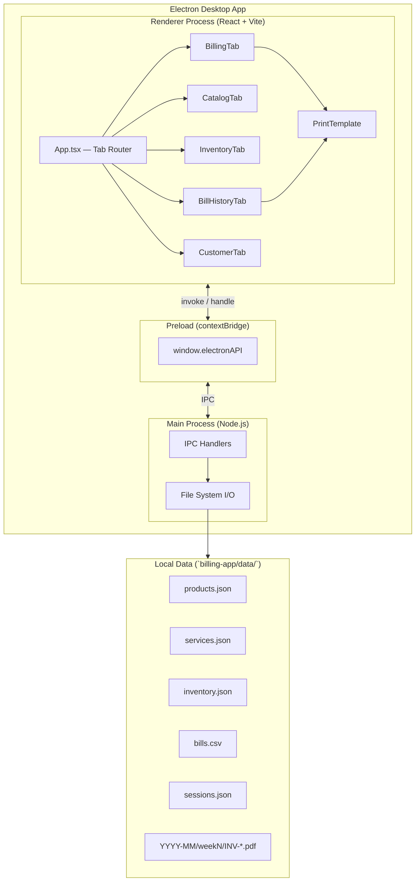
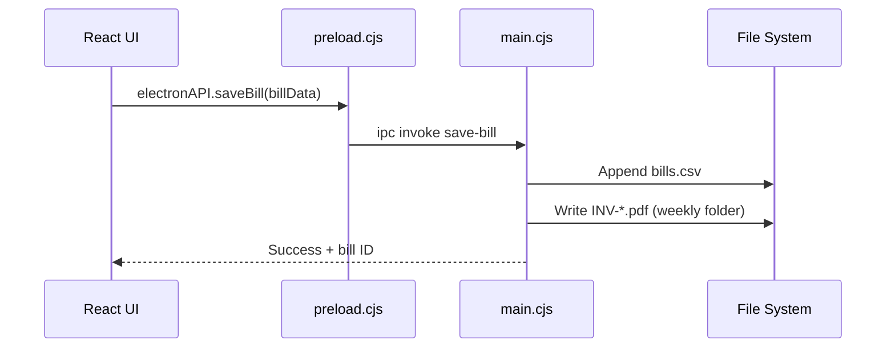

# Gulshan — Aesthetic Clinic Billing

Desktop billing application for **Premium Beauty & Clinic**. Built with **Electron**, **React**, and **TypeScript**, it handles invoicing, GST calculations, product/service catalog management, customer history, and PDF invoice export.

---

## Features

| Module | Description |
|--------|-------------|
| **Billing** | Create invoices with products & services, discounts, CGST/SGST |
| **Catalog** | Browse and manage product & service catalog |
| **Inventory** | Stock levels, price overrides, manual items |
| **Bill History** | View and reprint past invoices |
| **Customers** | Client list derived from billing history |
| **Print / PDF** | Print-ready invoice layout with clinic logo & stamp |

---

## Architecture



### Request flow (save bill)



---

## Project structure

```
gulshan/
├── README.md
└── billing-app/
    ├── electron/
    │   ├── main.cjs          # Main process, IPC, file I/O
    │   └── preload.cjs       # Secure bridge to renderer
    ├── src/
    │   ├── App.tsx           # App shell & state
    │   ├── components/       # UI tabs & print template
    │   ├── assets/           # logo.jpeg, stamp.jpeg
    │   ├── constants.ts      # Default catalog fallback
    │   └── types.ts
    ├── data/
    │   ├── products.json     # Product catalog (seed)
    │   ├── services.json     # Service catalog (seed)
    │   └── inventory.json    # Overrides & manual items
    ├── package.json
    └── vite.config.ts
```

---

## Tech stack

- **Electron** — Desktop shell & native file access  
- **React 18** + **TypeScript** — UI  
- **Vite** — Dev server & production build  
- **Node.js fs** — Local JSON/CSV/PDF persistence  

---

## Prerequisites

- [Node.js](https://nodejs.org/) **18+** (LTS recommended)  
- **npm** (included with Node.js)  
- **Windows** (installer build targets NSIS; dev works cross-platform)

---

## Getting started

### 1. Clone the repository

```bash
git clone https://github.com/DineshTechCrafts/Gulshan-Project.git
cd Gulshan-Project/billing-app
```

### 2. Install dependencies

```bash
npm install
```

### 3. Run in development

Starts the Vite dev server and Electron together:

```bash
npm start
```

| Script | Command | Purpose |
|--------|---------|---------|
| Dev UI only | `npm run dev` | Vite on `http://localhost:5173` |
| Electron only | `npm run electron:start` | Electron (expects Vite running) |
| **Full app** | **`npm start`** | **Recommended — both together** |

### 4. Lint

```bash
npm run lint
```

---

## Production build

Build the React app and package a Windows installer:

```bash
npm run build          # Compile TypeScript + Vite → dist/
npm run electron:build # Build + electron-builder → release/
```

The installer is output under `billing-app/release/`.

---

## Data & runtime files

On first run, the app reads/writes under `billing-app/data/`:

| File | Role |
|------|------|
| `products.json` | Product catalog |
| `services.json` | Service catalog |
| `inventory.json` | Price/stock overrides |
| `bills.csv` | Bill history (created on first save) |
| `sessions.json` | Service sitting progress (created when needed) |
| `YYYY-MM/weekN/*.pdf` | Exported invoice PDFs |

These runtime files are **gitignored** except the seed catalog files.

---

## IPC API (preload bridge)

| Method | Description |
|--------|-------------|
| `getInventory()` | Load catalog + overrides |
| `saveInventory(data)` | Persist inventory state |
| `getBills()` | Read bill history |
| `getNextBillId()` | Generate next invoice number |
| `saveBill(data)` | Save bill + CSV row |
| `savePdf(filename)` | Export invoice PDF |
| `getSessions()` / `saveSessions(data)` | Service session tracking |

---

## License

Private project — All rights reserved.
